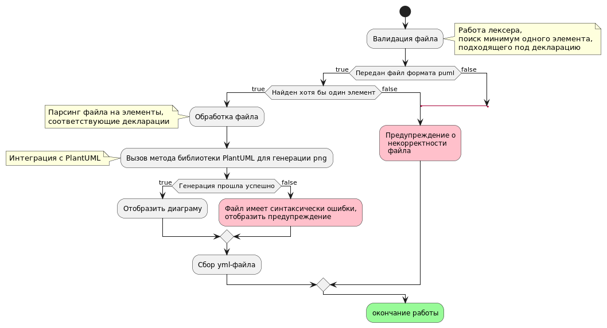
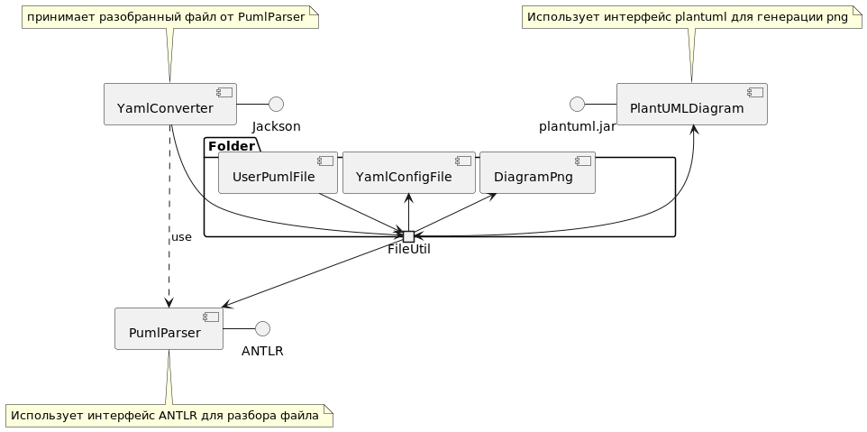

# javaBeanGenerator-documentation

| Имя файла                                           | Тип диаграмы           |
|-----------------------------------------------------|------------------------|
| [JavaBeanGeneratorActivity.puml][ActivityDiagram]   | Диаграмма активности   |
| [JavaBeanGeneratorClass.puml][ClassDiagram]         | Диаграма классов       |
| [JavaBeanGeneratorComponent.puml][ComponentDiagram] | Диаграма компонентов   |
| [JavaBeanGeneratorUseCase.puml][UseCaseDiagram]     | Диаграма использования |

[ActivityDiagram]: src/main/resources/diagram/JavaBeanGeneratorActivity.puml
[ClassDiagram]: src/main/resources/diagram/JavaBeanGeneratorClass.puml
[ComponentDiagram]: src/main/resources/diagram/JavaBeanGeneratorComponent.puml
[UseCaseDiagram]: src/main/resources/diagram/JavaBeanGeneratorUseCase.puml

Диаграмы
=
Диаграма использования
-

https://plantuml.com/ru/use-case-diagram

Основной задачей API является генерация бизнес-объектов на основе Puml диаграм активности.

Диаграма активности
-

https://plantuml.com/ru/activity-diagram-beta\

Процесс заключается в валидации файла, его разбора в соответствии с декларацией и формирования
YAML-файла на основе распаршенных элементов puml файла

Диаграма классов
-

https://plantuml.com/ru/class-diagram

В API основную роль играют два класса:
PumlParser - разбирает файл puml, основываясь на дексларации лексера
YmlConverter - собирает файл yml конфигурации бинов на основе элементов puml файла

Диаграма Компонетов
-

https://plantuml.com/ru/component-diagram

Работа компонента PumlParser зависит от интерфейса ANTLR, который, в свою очередь предоставляет
функциональность лексера и парсера.
PumlParser для своего функционирование также использует дс(обычный текстовый файл), читая с него файл декларации
Работа компонента YmlConverter в свою очередь использует результат работы YmlConverter.

